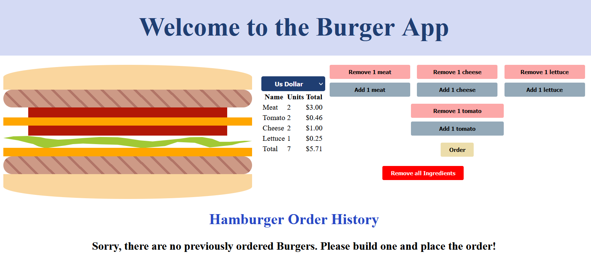
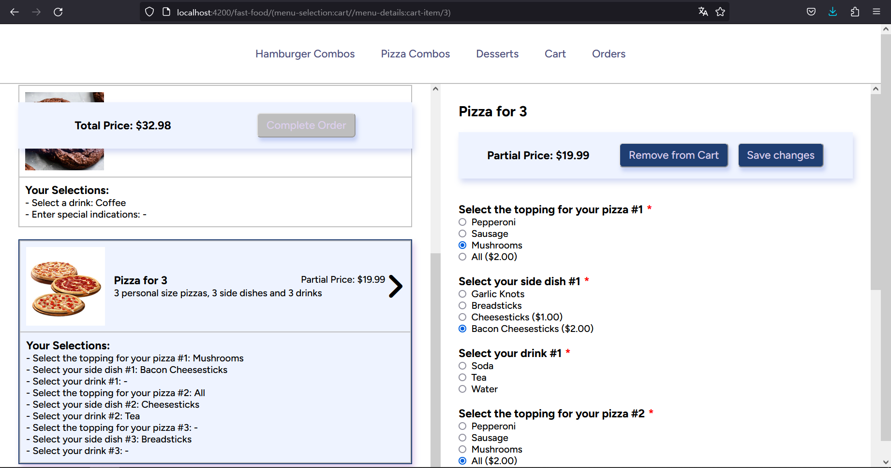
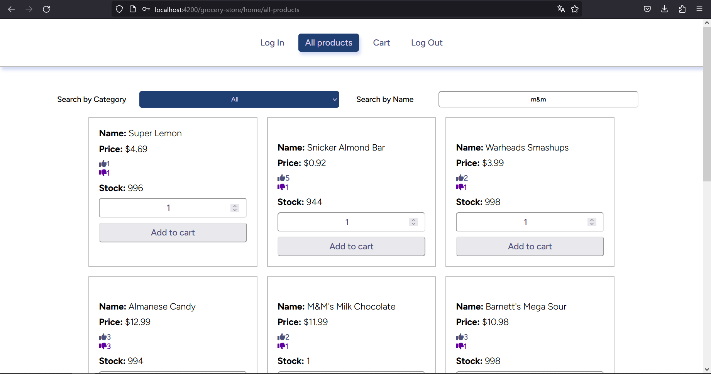

# Angular Verse

<div>
  <p>
    The Angular Verse repository is a comprehensive collection of projects built using the Angular framework. It serves as a testament to the versatility and power of Angular across various domains and functionalities. This repository houses a wide spectrum of projects that demonstrate different aspects of Angular, including interaction with backend REST APIs, security measures like guards and JWT authentication, state management with NgRx, development of reactive web pages, and robust testing using Jest.
  </p>
  
</div>

## Projects

### [Burger Store](./burger-store)

The Burger Store project is an interactive web application that allows users to create and customize their own hamburgers with a variety of ingredients. With a user-friendly interface, customers can personalize their burgers by adding cheese, tomato, lettuce, and meat to suit their taste preferences.



### [Car Accordion](./car-accordion)

Car accordion is a dynamic web application that showcases cars from three different countries: Germany, the United States, and Japan. The user interface is designed using accordions, which allow for an organized and collapsible display of car information.


### [Fast Food](./fast-food)

The Angular application is a dynamic web-based ordering system that offers a wide selection of hamburger and pizza combos, as well as desserts. It provides users with an intuitive interface to browse through the available menu items, add them to their cart, and view their past orders.



### [Github Profile Fetcher](./github-profile-fetcher/)

It is a lightweight web application that utilizes GitHub's API to retrieve data for a specific user. It requires the use of a GitHub token for authentication and authorization purposes. It displays the user's main information, repositories and followers.


### [Grocery Store](./grocery-store/)

It is a user-friendly web application that emulates a grocery store experience. It provides users with an intuitive interface to browse through various grocery products, add them to a virtual cart, and simulate the process of shopping for groceries.



### [Grocery Store Testing](./grocery-store-testing/)

The provided unit tests do not represent a standalone application but instead serve as a comprehensive test suite for the [Grocery Store](#grocery-store) app. These tests are designed to showcase the accurate functionality of various components within the application.The unit tests cover a wide range of scenarios to ensure that each component of the Grocery Store app performs as expected. By executing these tests, we can validate that the components are functioning correctly and that they meet the desired requirements.


### [Reactive Form](./reactive-form/)

The Angular project is centered around the implementation of reactive forms to collect user information. It provides a robust and dynamic user interface for capturing details such as the user's name, last name, password, age, phone number, and more. The form includes various input fields to capture different aspects of the user's information. Each input field is accompanied by appropriate validation rules to ensure the accuracy and integrity of the captured data. For instance, the name and last name fields may require a minimum and maximum length, while the password field may enforce complexity requirements.


### <a href="https://gitlab.com/conradbravina/tmdb-movies-explorer" target="_blank">TMDB Movies Explorer</a>

The Angular app is designed to provide users with a seamless experience to browse, display, and add movies to their favorites. It leverages TMDB's systems, including the TMDB API for movie data retrieval and a login system for user authentication.


### [User Management System](./user-management-system/)

The CRUD app built with Angular focuses on managing user data through a user-friendly interface. It allows users to perform essential operations such as creating new users, retrieving user information, updating user details, and deleting user records.


## Requirements

Before running the projects in this repository, please ensure that you have the following requirements installed on your machine:

1. [Node.js](https://nodejs.org/): Make sure you have Node.js installed on your system. You can download it from the official Node.js website: [https://nodejs.org/](https://nodejs.org/).

2. [Git](https://git-scm.com/): Git is used for version control and is required to clone this repository and manage the project files. If you don't have Git installed, you can download it from the official Git website: [https://git-scm.com/](https://git-scm.com/).

3. [Angular CLI](https://angular.io/cli): The Angular CLI (Command Line Interface) is a powerful command-line tool designed to streamline and enhance the development process of Angular applications. It provides a set of commands and utilities that enable developers to efficiently scaffold, build, test, and deploy Angular projects. You can use the following command by using npm `npm install -g @angular/cli`.

Please make sure to install these requirements before proceeding with the projects in this repository.

## Usage

Each project in this repository is organized within its own directory and can be executed independently. If you're interested in a specific project, simply click on its directory, and the corresponding Readme.md file will provide instructions on how to run it. Feel free to clone this repository without hesitation, as the dependencies are not uploaded, and it will not occupy much space on your system.

1. Clone this repository

```
git clone https://github.com/A-Cobra/angular.git
```

2. Move to the develop branch

```
git checkout develop
```

3. Double-click on the project folder that interest you the most

4. Read and follow along the instructions provided in the Readme.md files

## License

This project is licensed under the [Apache License 2.0](./LICENSE).

## Conclusion

In conclusion, the Angular repository we have discussed is a comprehensive collection of multiple Angular projects. It serves as a centralized hub for managing and organizing various Angular applications within a single codebase.
