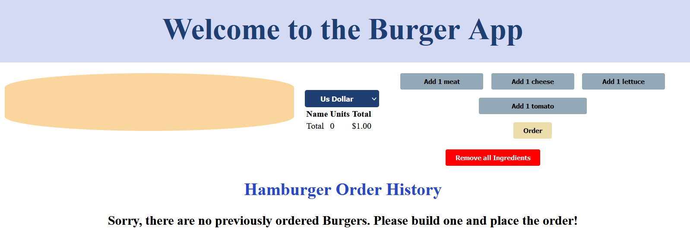
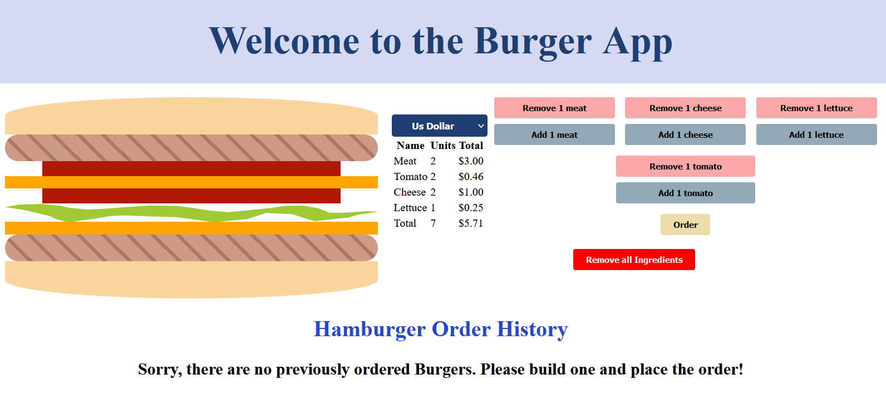
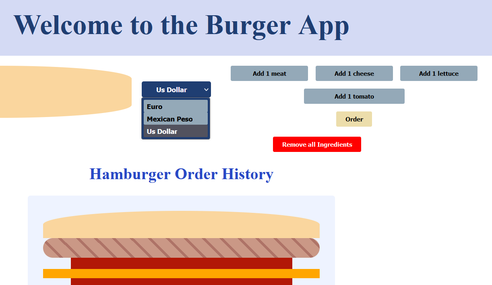
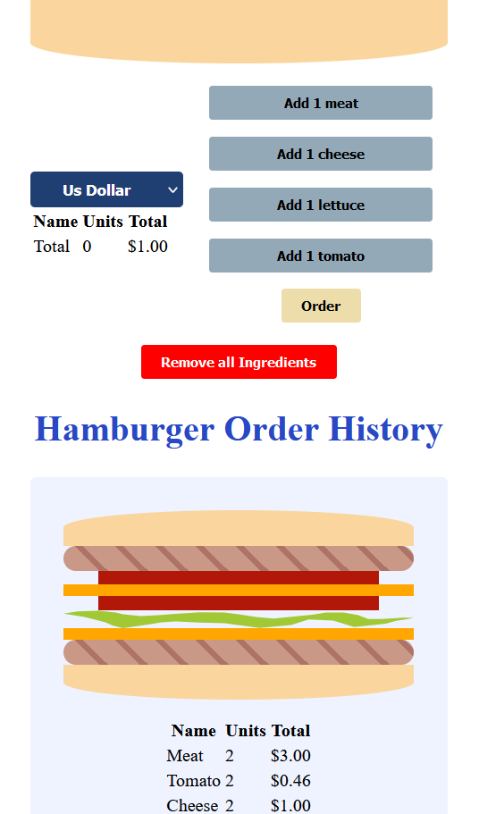

# Burger App

This Angular application offers a delightful burger customization experience, allowing users to personalize their burgers by adding or removing ingredients such as tomatoes, lettuce, meat, and cheese.

One of the standout features of the Burger Store is the ability to view and compare prices in multiple currencies. Users have the option to see the prices of their customized burgers in USD, Euros, and Mexican pesos, providing a convenient and flexible shopping experience for customers from different regions.

Once the user has created their perfect burger, they can proceed to "order" it. The order will be stored and displayed in a history section, allowing users to revisit their previous orders and easily reorder their favorite combinations. This feature adds convenience for customers who frequently order the same burger or want to keep track of their culinary experiments.

## Key Features

1. User-Friendly Interface: The Burger Store features an intuitive and visually appealing interface that enhances the user experience. Customers can effortlessly navigate through the customization options, view prices, and manage their orders.

2. Responsive Design: The application is designed to be responsive and adaptable to different devices and screen sizes, ensuring a consistent and enjoyable experience for users on desktops, tablets, and mobile devices.

## Screenshots






## Requirements

Before running the application, make sure you have [Node.js](https://nodejs.org) (minimum version 12.0.0) and [Angular CLI](https://angular.io/cli) installed on your machine.

Use the package manager [npm](https://www.npmjs.com/) to install the dependencies and run the application.

## Usage

After sufficing the requirements for the app, follow the steps in order to run the program:

1.  Clone the repository by using the following command

    ```
    git clone `https:github.com/A-Cobra/angular`
    ```

2.  Use the git command

    ```
    git checkout develop
    ```

3.  Open the `burger-store` folder with your favorite ide

4.  Use the following command

    ```
    npm install
    ```

5.  Finally, run the app by using the command

    ```
    npm run sto
    ```

6.  Alternatively, you could run the following command

    ```
    ng serve
    ```

## License

This project is licensed under the [Apache License 2.0](../LICENSE).
