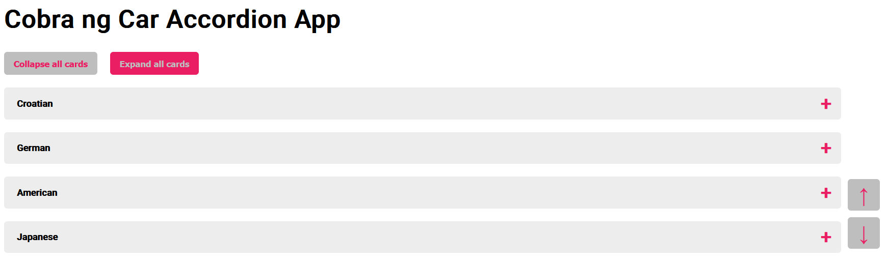
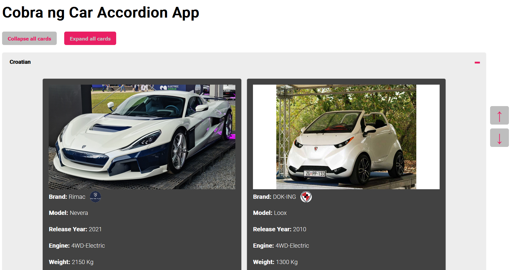
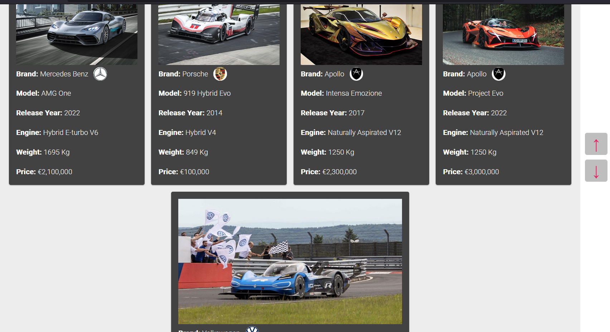
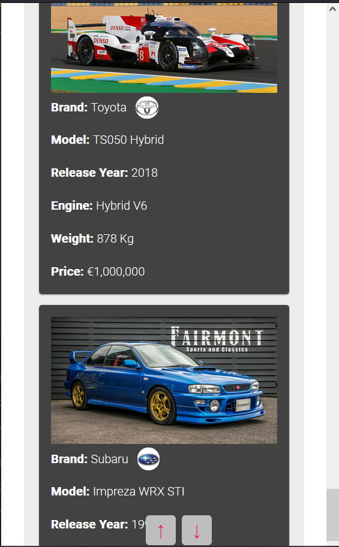

# Car Accordion

The Angular Accordion Car App is a simple yet intuitive application that allows users to explore a collection of cars through an accordion-style interface. The app is designed to showcase the functionality of Angular's Inputs feature while keeping the overall complexity low by not retrieving data from a server.

The main screen of the app displays multiple accordions, each representing a country. The cards are initially collapsed, showing only the country's name. Users can expand individual cards by clicking on them, revealing a set of card displaying car models for the current selected country.

## Key Features

1. **Interactive Buttons**: To enhance usability, the app includes two convenient buttons that enables users to expand or collapse all accordions at once. This feature provides a simple and efficient way to control the visibility of the car cards, allowing users to quickly navigate through the collection based on their preferences.

2. **Responsive Design**: The application is designed to be responsive and adaptable to different devices and screen sizes, ensuring a consistent and enjoyable experience for users on desktops, tablets, and mobile devices.

3. **Navigation Buttons**: These buttons facilitate smooth scrolling, enabling users to easily navigate back to the top or bottom of the car list. This enhances the overall user experience by reducing the effort required for navigation, especially when dealing with a large number of cars.

## Screenshots






## Requirements

Before running the application, make sure you have [Node.js](https://nodejs.org) (minimum version 12.0.0), git, and [Angular CLI](https://angular.io/cli) installed on your machine.

Use the package manager [npm](https://www.npmjs.com/) to install the dependencies and run the application.

## Usage

After sufficing the requirements for the app, follow the steps in order to run the program:

1.  Clone the repository by using the following command

    ```
    git clone https://github.com/A-Cobra/angular.git
    ```

2.  Use the git command

    ```
    git checkout develop
    ```

3.  Open the `car-accordion` folder with your favorite ide

4.  Use the following command

    ```
    npm install
    ```

5.  Finally, run the app by using the command

    ```
    npm run sto
    ```

6.  Alternatively, you could run the following command

    ```
    ng serve
    ```

7.  If the website has not been automatically opened yet, please visit the following link:

    ```
    localhost:4200
    ```

## Technologies:

- **Angular 14**: Angular is a popular and powerful JavaScript framework for building web applications. Angular provides a comprehensive set of tools and libraries for developing dynamic and scalable applications. It follows the component-based architecture, allowing developers to create reusable components that encapsulate specific functionality.

- **SCSS**: SCSS (Sass) is a CSS preprocessor that extends the capabilities of traditional CSS. By utilizing SCSS in my project, I was able to "draw" the ingredients of the burger with enhanced flexibility and maintainability.

- **ESLint**: ESLint is a popular JavaScript linter that helps ensure code correctness and adherence to best practices. ESLint enforces a set of configurable rules that catch potential issues, enforce coding standards, and promote consistent code style across Angular applications. It helps identify problematic patterns, potential bugs, and code smells, allowing engineers to address them early in the development process and maintain a high level of code quality.

## Additional Information

While the app currently relies on static data, its design allows for future enhancements to retrieve car information from a server. This would enable the app to dynamically fetch and display the latest car data, ensuring that users always have access to the most up-to-date information.

## License

This project is licensed under the [Apache License 2.0](../LICENSE).

## Conclusions

Overall, the Angular Accordion Car App offers a user-friendly interface, making it easy for users to explore and compare different cars. With its collapsible accordion cards, expand/collapse all functionality, and intuitive navigation buttons, the app provides a simple yet effective way to showcase car details and enhance the user experience.
