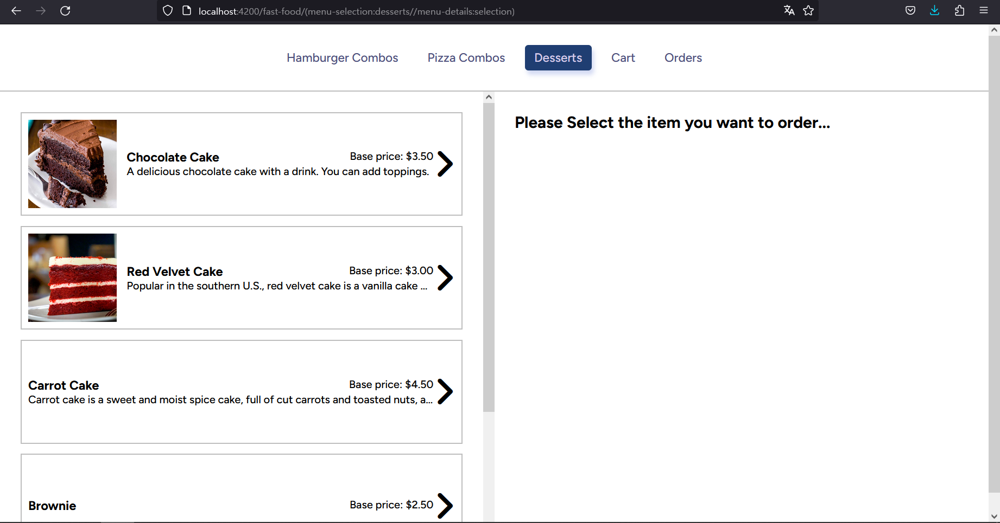
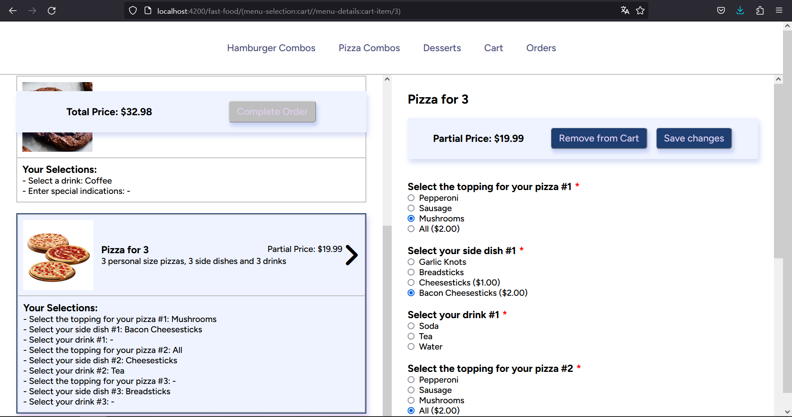
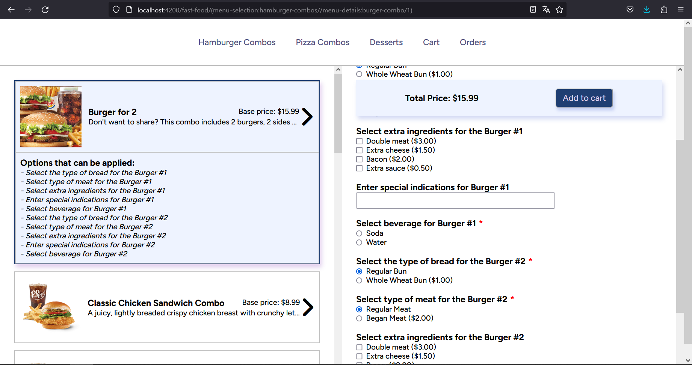
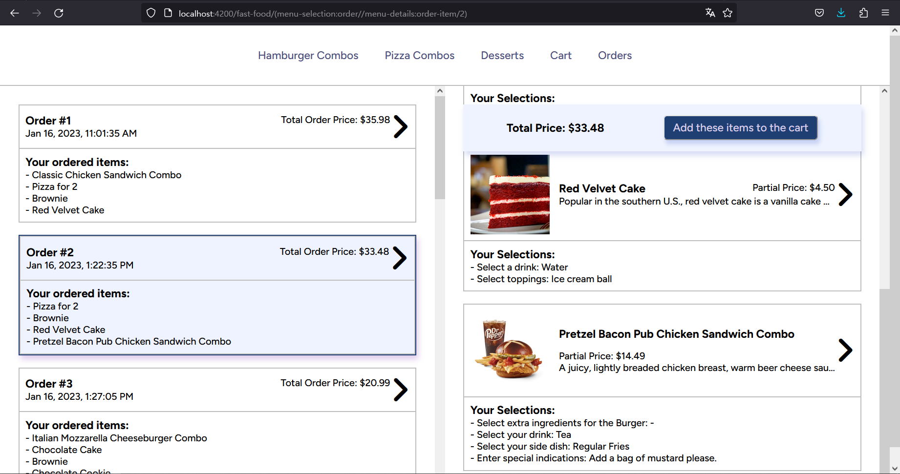
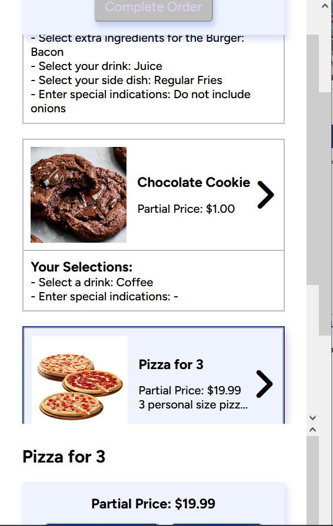

# Fast Food

The Angular application at hand offers a seamless dining experience, allowing users to navigate through a variety of food options, including burger combos, pizza combos, and desserts. Users can effortlessly explore the available selections, add them to a cart, and place orders. The orders can be conveniently viewed and managed within the "Orders" tab of the application.

## Key Features

1. **Separated Windows**: The application's main screen is thoughtfully divided into two sections, each controlled by its respective router outlet using named outlets. This design enables users to access more detailed information about the combos, desserts, and orders. It also provides the flexibility to display a formulary, allowing users to make additional selections for the products.

2. **Dynamically Generated Forms**: The application incorporates dynamically generated reactive forms. These forms are generated dynamically based on the available selections in the food categories. This approach offers a dynamic and intuitive user interface, allowing users to customize their orders with ease.

3. **Guards**: To enhance user experience and ensure data integrity, guards are implemented. These guards prevent users from navigating to the cart if the cart is empty. By enforcing this restriction, the application promotes a seamless and error-free ordering process, ensuring that users only access the cart when it contains items.

## Screenshots

Main Page



Editing in Cart



Dynamic formulary



Review Orders



Mobile experience



## Requirements

Before running the application, make sure you have [Node.js](https://nodejs.org) (minimum version 12.0.0), git, and [Angular CLI](https://angular.io/cli) installed on your machine.

Use the package manager [npm](https://www.npmjs.com/) to install the dependencies and run the application.

## Usage

After sufficing the requirements for the app, follow the steps in order to run the program:

1.  Clone the repository by using the following command

    ```
    git clone https://github.com/A-Cobra/angular.git
    ```

2.  Use the git command

    ```
    git checkout develop
    ```

3.  Open the `fast-food` folder with your favorite ide

4.  Use the following command

    ```
    npm install
    ```

5.  Run the following command to spin up the database:

    ```
    npm run db
    ```

6.  Finally, run the app by using the command

    ```
    npm run sto
    ```

7.  Alternatively, you could run the following command

    ```
    ng serve
    ```

8.  If the website has not been automatically opened yet, please visit the following link:

    ```
    localhost:4200
    ```

## Technologies:

- **Angular 14**: Angular is a popular and powerful JavaScript framework for building web applications. Angular provides a comprehensive set of tools and libraries for developing dynamic and scalable applications. It follows the component-based architecture, allowing developers to create reusable components that encapsulate specific functionality.

- **SCSS**: SCSS (Sass) is a CSS preprocessor that extends the capabilities of traditional CSS. By utilizing SCSS in my project, I was able to "draw" the ingredients of the burger with enhanced flexibility and maintainability.

- **ESLint**: SLint is a popular JavaScript linter that helps ensure code correctness and adherence to best practices. ESLint enforces a set of configurable rules that catch potential issues, enforce coding standards, and promote consistent code style across Angular applications. It helps identify problematic patterns, potential bugs, and code smells, allowing engineers to address them early in the development process and maintain a high level of code quality.

## Additional Information

To simulate interactions with an API, the application utilizes a JSON database. This allows users to experience the functionality of interacting with data, even though the interactions are simulated. The JSON database ensures a smooth user experience while navigating and interacting with the various food options.

While the app currently relies on a fake API, its design allows for future enhancements to retrieve information from a server. This would enable the app to dynamically fetch and display the latest data, ensuring that users always have access to the most up-to-date information.

## License

This project is licensed under the [Apache License 2.0](../LICENSE).

## Conclusions

In summary, this Angular application provides a user-friendly interface for navigating and ordering from a diverse menu of burger combos, pizza combos, and desserts. With its use of named outlets, dynamic forms, simulated API interactions, and guards for cart navigation, the application delivers a smooth and intuitive dining experience for users.
