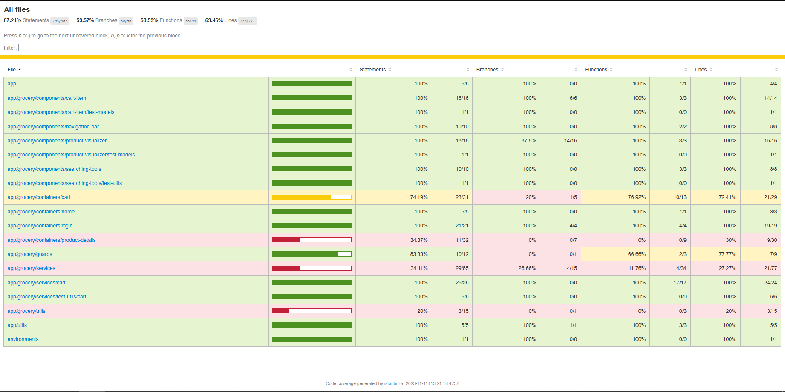

# Grocery Store Testing

The Grocery Store Testing project aimed to ensure the reliability and correctness of the "grocery-store" Angular app through comprehensive unit testing. The primary focus was to test various aspects of the application, including components, guards, HTTP services, and other critical functionalities. The goal was to establish a robust testing suite that would validate the behavior and performance of the codebase.

## Key Features

1. **Application Unit Testing**: It is a software development practice that involves testing individual units or components of an application in isolation to ensure their proper functionality. These units can include functions, methods, classes, components, services, and other discrete parts of the software. The primary goal of Application Unit Testing is to validate the behavior and correctness of each unit of code. By writing test cases that cover various scenarios and expected outcomes, developers can verify that the individual units perform as intended and meet the project's requirements.

## Screenshots

Running tests on the console


Console report


Website report



How to find the file


## Requirements

Before running the application, make sure you have [Node.js](https://nodejs.org) (minimum version 12.0.0), git, and [Angular CLI](https://angular.io/cli) installed on your machine.

Use the package manager [npm](https://www.npmjs.com/) to install the dependencies and run the application.

## Usage

After sufficing the requirements for the app, follow the steps in order to run the program:

1.  Clone the repository by using the following command

    ```
    git clone https://github.com/A-Cobra/angular.git
    ```

2.  Use the Git command to switch to the develop branch:

    ```
    git checkout develop
    ```

3.  Open the `grocery-store-testing` folder with your favorite ide

4.  Install the necessary dependencies by running the following command:

    ```
    npm install
    ```

5.  To generate the test coverage report, execute the following command. The report will appear in your project directory:

    ```
    npm run test:coverage
    ```

6.  In the console, you will see the tests being executed in real-time.

7.  Once all the tests are completed, a folder named `coverage` will be generated.

8.  Navigate into the `coverage` folder and locate the `lcov-report` subfolder.

9.  Finally, open the `index.html` file in your preferred browser to view the test coverage report.

## Technologies:

- **Jest Testing Framework**: Jest is a widely-used testing framework for JavaScript applications, including Angular projects. It offers a robust and intuitive testing solution that helps ensure the reliability and correctness of the codebase. Jest provides a seamless testing experience with its rich set of features, making it a preferred choice for many developers.

## Additional Information

Initially, the project utilized the Karmin and Jasmine testing frameworks. However, to align with industry standards and leverage a more widely adopted solution, the decision was made to transition to the Jest testing framework. Jest offers a rich set of features, a user-friendly interface, and extensive community support, making it a popular choice for testing Angular applications.

It is also important to note that due to time constraints during the project development, there might be some tests that do not pass as certain code sections were left untested using the testing framework. However, it should be emphasized that these untested portions of code were manually tested to ensure their functionality.

## License

This project is licensed under the [Apache License 2.0](../LICENSE).

## Conclusions

In conclusion, the Angular project for the "grocery-store" app prioritized the implementation of comprehensive unit tests to validate the functionality of components, guards, HTTP services, and other critical aspects. The project made the strategic decision to switch from the Karmin and Jasmine testing frameworks to Jest, primarily due to the widespread adoption and extensive features offered by Jest.

By embracing Jest as the testing framework, the project aimed to improve the testing experience, leverage a more intuitive syntax, and benefit from the extensive community support available. The transition to Jest was undertaken to ensure that the unit tests were written in a maintainable and effective manner, ultimately leading to a more reliable and stable "grocery-store" app.
