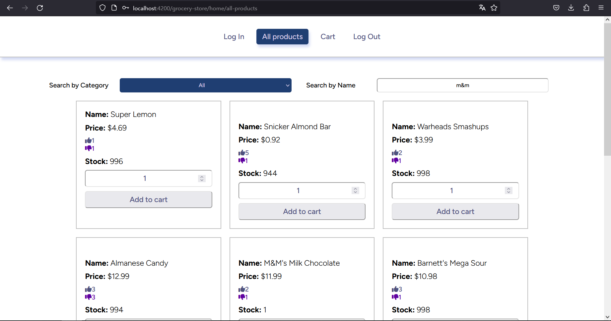
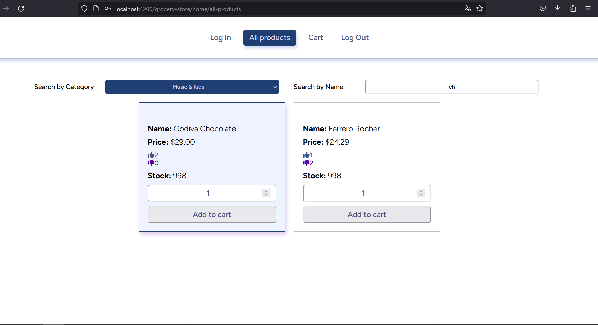
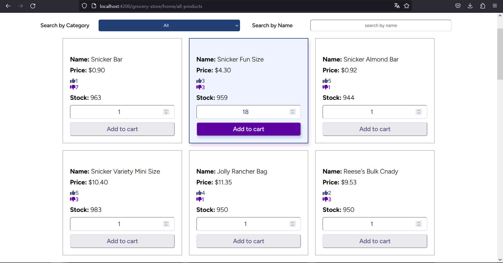

# Grocery Store ⚠️(DEPRECATED)⚠️

The Angular application was designed with the intention of utilizing guards and an API. The primary goal was to enable users to browse and interact with an online store by viewing and adding items to their cart. The application incorporated Angular guards to control access to different routes based on user authentication and authorization.

The API served as the backbone for retrieving product information and managing the cart functionality. Through the API, the application aimed to display a catalog of available items, allow users to search and filter products, and enable them to add selected items to their cart for purchase.

## Important Information

⚠️ Please note that due to nondisclosure agreements, I am unable to share the credentials to access the application.

As of the current date (2023/11/10), while the API supports login functionality, certain features such as adding items to the cart or retrieving items from it are restricted and inaccessible.

Therefore, it is recommended **NOT** to install the dependencies for this project, as there may be limited exploration possibilities. Thank you for your understanding. ❗️

## Key Features

1. **Filter by name and category**: The API provides the capability to retrieve products based on user-defined filters such as name and category. These filters can be used individually or in combination, allowing users to refine their search criteria and retrieve products that meet their specific requirements.

2. **Styling**: The API provides the capability to retrieve products based on user-defined filters such as name and category. These filters can be used individually or in combination, allowing users to refine their search criteria and retrieve products that meet their specific requirements.

## Screenshots

Search



Using both filters at the same time



Color palette



## Requirements

To utilize the application, users need a credential. However, it is not possible to be obtained at the moment (2023/1/10).

Before running the application, make sure you have [Node.js](https://nodejs.org) (minimum version 12.0.0), git, and [Angular CLI](https://angular.io/cli) installed on your machine.

Use the package manager [npm](https://www.npmjs.com/) to install the dependencies and run the application.

## Usage

After sufficing the requirements for the app, follow the steps in order to run the program:

1.  Clone the repository by using the following command

    ```
    git clone https://github.com/A-Cobra/angular.git
    ```

2.  Use the git command

    ```
    git checkout develop
    ```

3.  Open the `grocery-store` folder with your favorite ide

4.  Use the following command

    ```
    npm install
    ```

5.  Finally, run the app by using the command

    ```
    npm run sto
    ```

6.  Alternatively, you could run the following command

    ```
    ng serve
    ```

7.  If the website has not been automatically opened yet, please visit the following link:

    ```
    localhost:4200
    ```

## Technologies:

- **Angular 14**: Angular is a popular and powerful JavaScript framework for building web applications. Angular provides a comprehensive set of tools and libraries for developing dynamic and scalable applications. It follows the component-based architecture, allowing developers to create reusable components that encapsulate specific functionality.

- **SCSS**: SCSS (Sass) is a CSS preprocessor that extends the capabilities of traditional CSS. By utilizing SCSS in my project, I was able to "draw" the ingredients of the burger with enhanced flexibility and maintainability.

- **ESLint**: ESLint is a popular JavaScript linter that helps ensure code correctness and adherence to best practices. ESLint enforces a set of configurable rules that catch potential issues, enforce coding standards, and promote consistent code style across Angular applications. It helps identify problematic patterns, potential bugs, and code smells, allowing engineers to address them early in the development process and maintain a high level of code quality.

- **REST API**: REST (Representational State Transfer) is an architectural style for designing networked applications. REST APIs (Application Programming Interfaces) are a set of rules and conventions that enable communication and data exchange between systems over the internet. REST APIs are based on the principles of using HTTP methods (such as GET, POST, PUT, DELETE) to perform operations on resources identified by URLs (Uniform Resource Locators).

## License

This project is licensed under the [Apache License 2.0](../LICENSE).

## Conclusions

Considering the limitations imposed by the current API status and the unavailability of credentials, it is strongly advised against investing time and effort in installing the dependencies for this Angular application. Although the primary objective of the application was to deliver a seamless cart functionality and an engaging shopping experience, the existing circumstances hinder the complete realization of these features.

If you are interested in gaining a deeper understanding of API integration, you may find value in reviewing and exploring the source code. By examining the codebase and making alterations, you can delve into the concept of connecting to an API and gain insights into the underlying principles. This hands-on approach can provide valuable learning opportunities and enhance your comprehension of API interactions within an Angular application.
