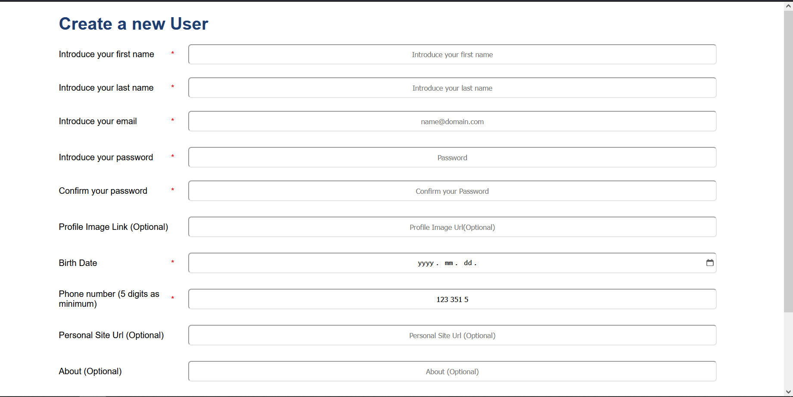
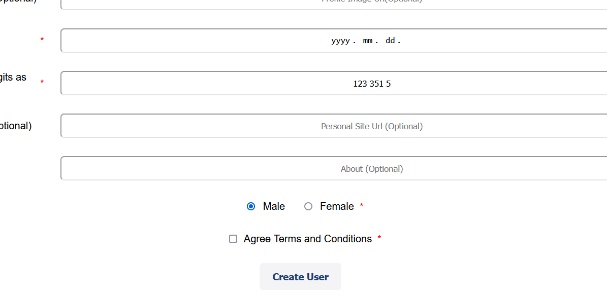
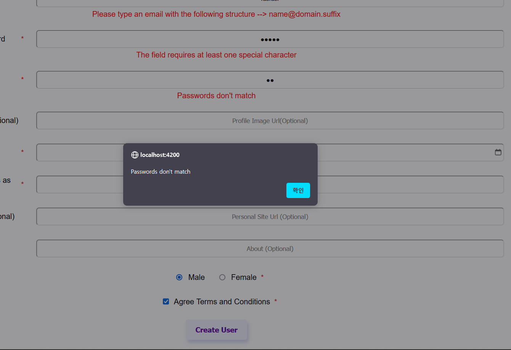
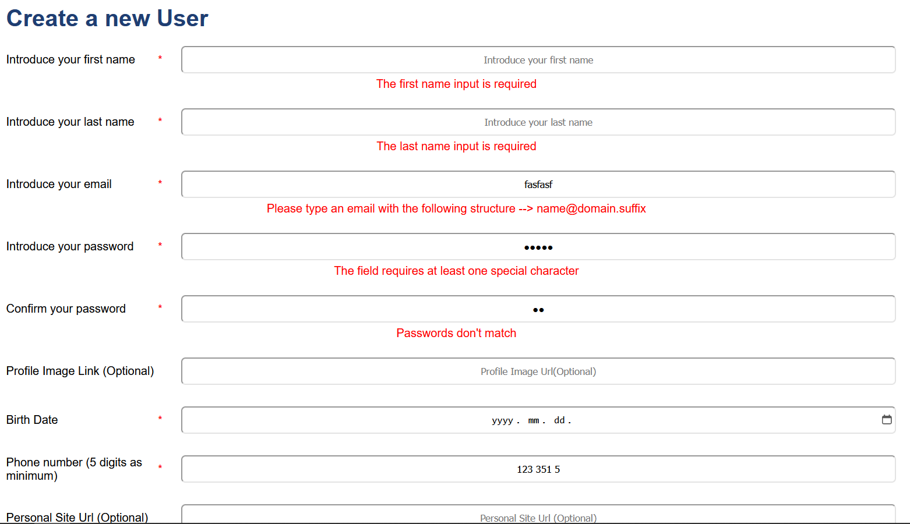
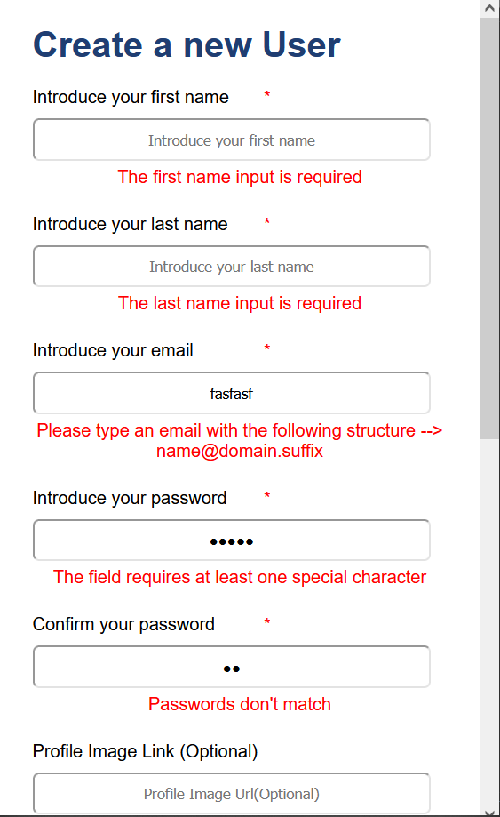

# Reactive Form

The Angular project is a web application that focuses on reactive forms and custom validations. The primary goal of the project is to provide a user-friendly interface for inputting and validating various form fields. The application includes several custom validators to enhance the data validation process.

## Key Features

1. **Custom validations**: One of the key features of the project is the implementation of custom validations for specific fields. For example, the application includes a custom validator to verify that a date input is smaller than the current date. This ensures that users cannot select future dates. Additionally, there is a password strength validator that checks the complexity of the password and provides feedback to the user on its strength. Furthermore, there is a password matching validator that ensures that the password and its confirmation match.

2. **Number directive**: This directive removes all non-numeric and letter characters from a field and formats it by adding a space every three numbers. This improves the user experience by automatically formatting the input in a more readable manner.

3. **Countries API**: Additionally, the application utilizes an external countries API to offer country-related functionality. However, due to limitations with the API, the project currently relies on tokens that have a one-day expiration period. This constraint renders the continuous use of the integration impractical. Therefore, the integration has been temporarily suspended, but the form itself remains fully functional and can be used without any issues.

## Screenshots

Main Page



Button disabled while the form is not valid



Message if the User removes the `Disabled` attribute.



Validations



Mobile experience



## Requirements

Before running the application, make sure you have [Node.js](https://nodejs.org) (minimum version 12.0.0), git, and [Angular CLI](https://angular.io/cli) installed on your machine.

Use the package manager [npm](https://www.npmjs.com/) to install the dependencies and run the application.

## Usage

After sufficing the requirements for the app, follow the steps in order to run the program:

1.  Clone the repository by using the following command

    ```
    git clone https://github.com/A-Cobra/angular.git
    ```

2.  Use the git command

    ```
    git checkout develop
    ```

3.  Open the `reactive-form` folder with your favorite ide

4.  Install the necessary dependencies by running the following command:

    ```
    npm install
    ```

5.  Finally, run the app by using the command

    ```
    npm run sto
    ```

6.  Alternatively, you could run the following command

    ```
    ng serve
    ```

7.  If the website has not been automatically opened yet, please visit the following link:

    ```
    localhost:4200
    ```

8.  While in the app, press `ctrl/cmd` + `shift` + `i` to open the browser developer tools.

9.  In the developer tools, click on the "Console" tab.

10. Fill in the form fields according to the error indications you receive. The form may have various validations, such as required fields, minimum length, or specific format requirements.

11. Once you have filled in the form correctly, attempt to submit it.

12. While attempting to submit the form, keep the browser console open.

13. If the form submission is successful, you should see a JavaScript object displayed in the console. This object will contain the information that was entered into the form.

## Technologies:

- **Angular 14**: Angular is a popular and powerful JavaScript framework for building web applications. Angular provides a comprehensive set of tools and libraries for developing dynamic and scalable applications. It follows the component-based architecture, allowing developers to create reusable components that encapsulate specific functionality.

- **Angular Reactive Forms**: Angular Reactive Forms is a fundamental feature of the Angular framework, which empowers developers to build dynamic and interactive web forms with ease. With Angular Reactive Forms, developers can create forms that are robust, scalable, and highly customizable. One of the key advantages of Angular Reactive Forms is its ability to handle complex form scenarios. Developers can define form controls, such as text inputs, checkboxes, and dropdowns, and apply various validations and custom validators to ensure data integrity. The framework also provides built-in support for asynchronous form validation, enabling developers to perform server-side validations and handle form submission accordingly.

## Additional Information

The application was designed to interact with a REST API in order to retrieve information about countries and states. However, there is a limitation with the API in that the Bearer token provided expires after a single day. Given this constraint, it would be impractical to maintain continuous access to the API. As a result, I made the decision to remove the requirement for country and state information from the application.

To accommodate this change, I have commented out a section of code in the `form.component.html` file. If you wish to test the application with the API, you can uncomment the relevant lines in the corresponding `HTML` and `TypeScript` files to enable the necessary validations. Additionally, you will need to modify the `authToken` variable in the `environments.ts` file with your own Bearer token.

For your convenience, here is the link to access the API: `https://www.universal-tutorial.com/rest-apis/free-rest-api-for-country-state-city`.

## License

This project is licensed under the [Apache License 2.0](../LICENSE).

## Conclusions

Overall, the Angular project is relatively straightforward, but it demonstrates important aspects of reactive forms and custom validations. It provides a user-friendly form interface with custom validators for date, password strength, and password matching. The number directive enhances input formatting, and the integration with the countries API showcases the ability to interact with external services, albeit with token limitations.
