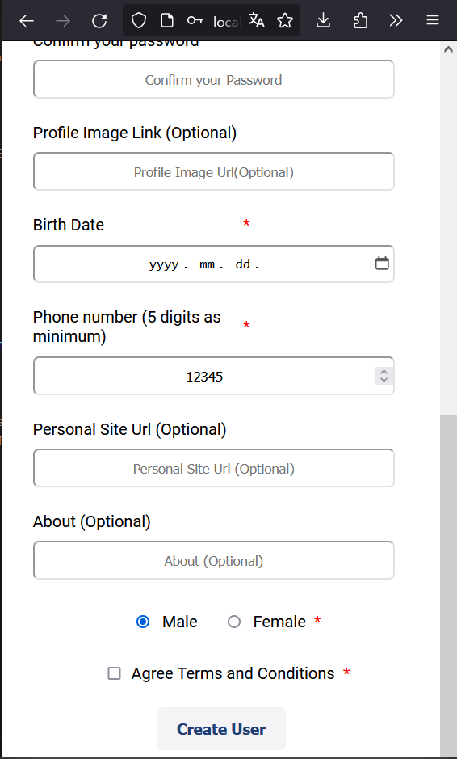

# User Management System

It is a web application built using Angular framework that provides administrators with the ability to efficiently manage employee data. The application offers a user-friendly interface where administrators can perform essential CRUD (Create, Read, Update, Delete) operations on employee records.

## Key Features

1. **Employee Listing**: The application displays a list of existing employees, providing essential details such as name, email, and gender. This allows administrators to quickly access employee details at a glance.

2. **Employee Creation**: Administrators can create new employee records by filling in a form with relevant information.

3. **Employee Editing**: The application allows administrators to edit employee information easily. It can be achieved by clicking on the "Edit this user" button.

4. **Employee Removal**: Administrators have the ability to remove employee records from the system when necessary. It can be achieved by clicking on the "Delete this user" button.

5. **User-Friendly Interface**: The Employee Management System prioritizes a clean and intuitive user interface, ensuring ease of use for administrators. Navigation menus, buttons, and forms are designed to be straightforward and self-explanatory, minimizing the learning curve for new users.

## Screenshots

Main Page


Create Employee


Single employee


Validations


Validations


Mobile main page


Mobile form



Mobile single employee


## Requirements

Before running the application, make sure you have [Node.js](https://nodejs.org) (minimum version 12.0.0), git, and [Angular CLI](https://angular.io/cli) installed on your machine.

Use the package manager [npm](https://www.npmjs.com/) to install the dependencies and run the application.

## Usage

After sufficing the requirements for the app, follow the steps in order to run the program:

1.  Clone the repository by using the following command

    ```
    git clone https://github.com/A-Cobra/angular.git
    ```

2.  Switch to the `develop` branch by using the following git command

    ```
    git checkout develop
    ```

3.  Open the `user-management-system` folder with your favorite ide

4.  Install the necessary dependencies by running the following command:

    ```
    npm install
    ```

5.  Run the following command to spin up the JSON API:

    ```
    npm run db
    ```

6.  Finally, run the app by using the command

    ```
    npm run sto
    ```

7.  Alternatively, you could run the following command

    ```
    ng serve
    ```

8.  If the website has not been automatically opened yet, please visit the following link:

    ```
    localhost:4200
    ```

## Technologies:

- **Angular 14**: Angular is a popular and powerful JavaScript framework for building web applications. Angular provides a comprehensive set of tools and libraries for developing dynamic and scalable applications. It follows the component-based architecture, allowing developers to create reusable components that encapsulate specific functionality.

- **Angular Template Driven Forms**: Angular Template Driven Forms is a powerful feature within the Angular framework that simplifies the development of forms in web applications. Built on the foundation of Angular 14, this feature enables developers to create dynamic and interactive forms with ease. By utilizing Angular Template Driven Forms, developers can expedite the creation of forms in their Angular 14 applications. With its intuitive syntax, extensive validation options, and seamless integration with the Angular ecosystem, this feature empowers developers to build robust and user-friendly forms efficiently, saving time and effort during the development process.

## Additional Information

1. The application was designed to interact with a REST API in order to retrieve information about countries and states. However, there is a limitation with the API in that the Bearer token provided expires after a single day. Given this constraint, it would be impractical to maintain continuous access to the API. As a result, I made the decision to remove the requirement for country and state information from the application.

   To accommodate this change, I have commented out a section of code in the `user-creation-form` folder. If you wish to test the application with the API, you can uncomment the relevant lines in the corresponding `HTML` file to enable the necessary validations. Additionally, you will need to modify the `authToken` variable in the `environments.ts` file with your own Bearer token.

   For your convenience, here is the link to access the API: `https://www.universal-tutorial.com/rest-apis/free-rest-api-for-country-state-city`.

2. The Employee Management System, being one of my initial projects, may not exhibit the same level of polish and refinement as more experienced projects. However, it is important to recognize that this project has been a valuable learning experience for me, allowing me to gain proficiency in Angular and form development.

   While the application successfully fulfills its core functionalities of employee management and effectively utilizes Angular Template Driven Forms, I acknowledge that there is room for improvement in terms of code quality. Refactoring the code to provide better cohesion and reduce dependencies would be a beneficial step towards enhancing the application's overall structure and maintainability.

   The Employee Management System serves as a testament to my growth and progress as a developer, showcasing my ability to implement key features and functionality within the Angular framework. As I continue to enhance my skills and undertake more projects, I am committed to applying the lessons learned from this project and striving for even greater refinement and sophistication in future applications.

## License

This project is licensed under the [Apache License 2.0](../LICENSE).

## Conclusions

Overall, the Employee Management System built with Angular provides a comprehensive solution for managing employee data. Its features, including template-driven forms and JSON API simulation, facilitate efficient employee record management, empowering administrators to create, view, edit, and remove employee information with ease.
